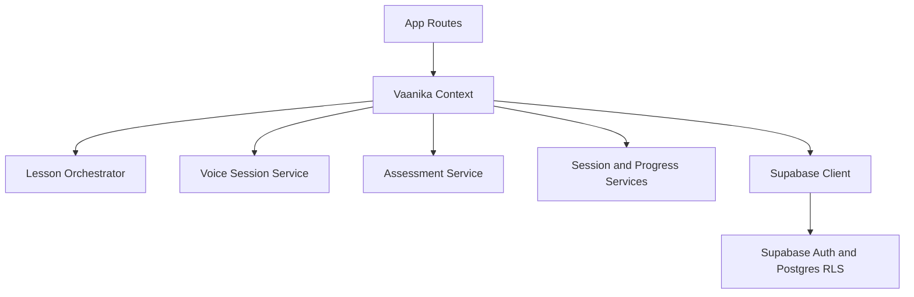

# Vaanika

Vaanika is a mobile-first AI language tutor prototype built with Expo and React Native.

## Tech Stack

<p align="left">
  
  
  
  
  
  
  
  
  
  
</p>

## MVP Direction

- Languages: Tamil, Spanish, English, and French.
- Learning mode: adaptive conversation practice.
- Voice routing: Sarvam for Tamil experiments; OpenAI Realtime for global-language realtime sessions.
- Tutor brain: provider-independent course generation, remediation, assessment scoring, and badge logic.
- Backend target: Supabase auth, database, storage, and edge functions.

## Product Flows

- Auth: sign in/sign up, protected routes, and sign-out access blocking.
- Onboarding: language + goal + learner need capture.
- Dashboard: generated course modules and provider routing display.
- Lesson: tutor-led steps with interruption/follow-up support.
- Assessment: guided response collection with model grading + deterministic fallback.
- Badge: pass/fail outcome, score breakdown, and certificate-style result.

## Architecture



Key paths:

- `app/` route-level UI and flow.
- `src/state/VaanikaContext.tsx` shared state + route actions.
- `src/services/lesson/lessonOrchestrator.ts` utterance classification and step logic.
- `src/services/voice/liveVoiceSession.ts` tutor audio + interruption pipeline.
- `src/services/assessment/assessmentService.ts` grading + fallback behavior.
- `src/services/session/*` lesson session, transcript, and step-event persistence.
- `src/web/WebShell.tsx` and `src/web/webImages.ts` centralized web visual shell.

## Local Development

```sh
npm install
npx tsc --noEmit
npm test
npm run ios
npm run android
npm run web
npm run e2e:web
```

Expo web dependencies are installed for future preview work, but the product target is the mobile app.
The current rollout includes a web fallback lesson mode with text-first interactions.

## Supabase Setup

The initial schema is in `supabase/migrations/20260517162000_initial_schema.sql`.

Apply it with one of these paths:

1. Link the repo with the Supabase CLI, then run `supabase db push`.
2. Paste the migration SQL into the Supabase SQL editor and run it once.

The app reads these public env vars:

```sh
EXPO_PUBLIC_SUPABASE_URL=
EXPO_PUBLIC_SUPABASE_ANON_KEY=
EXPO_PUBLIC_OPENAI_API_KEY=
EXPO_PUBLIC_GROK_API_KEY=
EXPO_PUBLIC_SARVAM_API_KEY=
```

For web integration/e2e tests, optionally provide:

```sh
E2E_EMAIL=
E2E_PASSWORD=
```

You can place them in `.env.local` at the repo root. Playwright loads this file automatically.

For DB verification after E2E, add:

```sh
SUPABASE_SERVICE_ROLE_KEY=
```

Useful commands:

```sh
npm run db:list
npm run db:push
npm run db:verify
npm run release:preflight:web
npm run e2e:web:fail
npm run release:preflight:web:fail
```

RLS is enabled for all learner-owned tables. Learner rows are scoped to `auth.uid()`.

### Free Plan Keepalive

Supabase Free Plan projects can pause after low activity. Vaanika includes a small keepalive path for development/demo environments:

- Migration: `supabase/migrations/20260605180000_add_keepalive_ping.sql`
- RPC: `public.keepalive_ping(p_source text)`
- Schedule: `.github/workflows/supabase-keepalive.yml`, every 3 days

The workflow uses the public anon key to call a security-definer RPC that updates only `public.app_keepalive`. It does not read or write learner data.

Required GitHub repository secrets:

```sh
EXPO_PUBLIC_SUPABASE_URL=
EXPO_PUBLIC_SUPABASE_ANON_KEY=
```

After applying migrations, test the RPC manually:

```sh
curl --fail --request POST \
  --header "apikey: $EXPO_PUBLIC_SUPABASE_ANON_KEY" \
  --header "Authorization: Bearer $EXPO_PUBLIC_SUPABASE_ANON_KEY" \
  --header "Content-Type: application/json" \
  --data '{"p_source":"manual"}' \
  "$EXPO_PUBLIC_SUPABASE_URL/rest/v1/rpc/keepalive_ping"
```

## Commands

Core quality gate:

```sh
npm test
npx tsc --noEmit
npm run e2e:web
npm run db:verify
```

Fail-path quality gate:

```sh
npm run e2e:web:fail
npm run db:verify:fail
npm run release:preflight:web:fail
```

Release preflight:

```sh
npm run release:preflight:web
```

## Web Deployment (Vercel)

Current web deployment uses Expo static export:

- Build command: `npx expo export --platform web`
- Output directory: `dist`
- Config file: `vercel.json`

If Git auto-deploy is not wired in a new team/workspace, deploy manually:

```sh
npx vercel --prod
```

After workspace/team changes, verify:

1. Correct Vercel team and project.
2. Git repo connected to this project.
3. Production branch is `main`.
4. All env vars re-added in that project.

## Current Implementation Notes

- `src/screens/MobilePrototypeScreen.tsx` contains the mobile prototype flow.
- `app/` contains the Expo Router mobile flow screens.
- `src/state/VaanikaContext.tsx` keeps shared learner state during the local MVP flow.
- `src/providers/providerRouter.ts` maps languages to the intended provider route.
- `src/services` contains mock voice and tutor-brain provider contracts.
- `src/backend/supabaseClient.ts` initializes Supabase only when public env vars are set.
- `src/services/auth` and `src/services/profile` contain Supabase-backed auth/profile calls with mock-mode fallbacks.
- `src/backend/schemaPlan.ts` documents the Supabase entities and planned edge functions.
- `docs/web-qa-seed-checklist.md` captures web seed data and SQL verification checks.
- `docs/vercel-release-checklist.md` captures release preflight and deployment checks.

## Troubleshooting

- If `/` redirects to `/dashboard` unexpectedly:
  - confirm current auth session status.
  - verify Supabase envs are set in the active deploy target.
  - latest startup fallback is signed-out when Supabase config is missing.
- If `supabase db push` reports up-to-date but behavior differs:
  - run `npm run db:list` and compare local/remote migration timestamps.
- If Playwright fails with missing browser binaries:
  - run `npx playwright install`.

## Next Build Steps

1. Replace mock/mobile-local voice auth paths with server-issued provider session tokens.
2. Add broader deterministic assessment fail/pass scenario seeding for repeatable CI users.
3. Expand web/mobile accessibility pass (roles, labels, keyboard navigation, focus states).
4. Finalize production deployment promotion workflow and fill `docs/web-release-signoff.md` per release.
